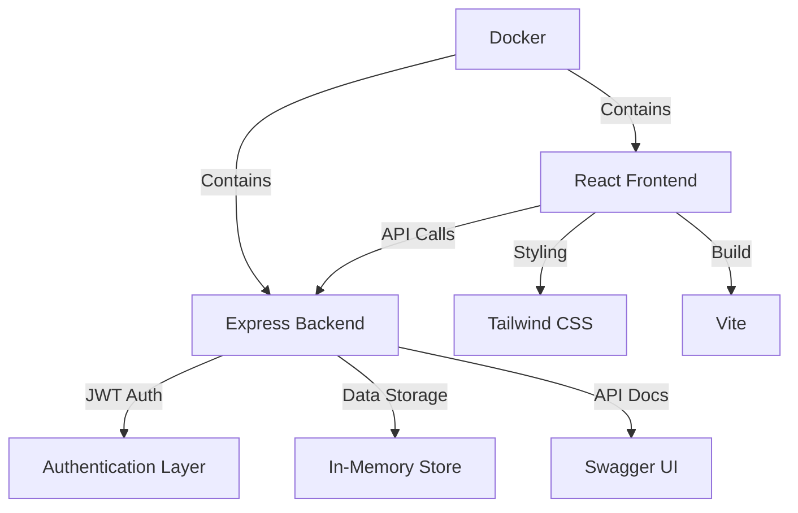

<div align="center">

# 🚀 **ProductiveHub** - Personal Productivity Dashboard

<p align="center">
  
  
  
  
</p>

### 🎯 *Your All-in-One Digital Command Center for Maximum Productivity*

*Transform chaos into clarity with an elegant, feature-rich dashboard that brings all your productivity tools under one beautiful interface.*

</div>

---

## 🌟 **Why Choose ProductiveHub?**

<table>
<tr>
<td align="center" width="33%">
<h3>🎨 Beautiful Design</h3>
Modern glassmorphism UI with smooth animations and gradient themes
</td>
<td align="center" width="33%">
<h3>⚡ Lightning Fast</h3>
Built with Vite and optimized for speed with minimal load times
</td>
<td align="center" width="33%">
<h3>🔧 Fully Integrated</h3>
All tools work seamlessly together with shared data and context
</td>
</tr>
</table>

## 📋 **Table of Contents**

| Section | Description |
|---------|-------------|
| [🎬 Quick Demo](#-quick-demo) | See it in action |
| [✨ Features](#-features) | What makes us special |
| [🛠️ Tech Stack](#️-tech-stack) | Built with modern tools |
| [📁 Project Structure](#-project-structure) | Organized architecture |
| [🚀 Installation](#-installation) | Get started in minutes |
| [📖 Usage](#-usage) | How to use each feature |
| [🔌 API Documentation](#-api-documentation) | Complete API reference |
| [🎨 Components](#-components-overview) | Frontend architecture |
| [⚙️ Configuration](#️-configuration) | Customize your setup |
| [🔧 Development](#-development) | Contributing guidelines |
| [🐳 Docker Support](#-docker-support) | Containerized deployment |
| [📈 Roadmap](#-future-enhancements) | What's coming next |

---

## 🎬 **Quick Demo**

> **🚀 Ready to see ProductiveHub in action?**

```bash
# One-command setup
git clone <your-repo-url> && cd personal_productivity_dashboard
docker-compose up --build
# Visit http://localhost:5173 and experience the magic! ✨
```

<div align="center">

| 📱 **Dashboard View** | 📝 **Notes Manager** | ⏰ **Smart Timers** |
|:---:|:---:|:---:|
|  |  |  |
| *Real-time productivity overview* | *Rich text editing with categories* | *Custom timers* |

</div>

## ✨ Features

### 🏠 Dashboard
- Real-time productivity metrics and insights
- Today's active reminders and priority tasks  
- Modern gradient design with smooth animations
- Quick access to all modules

### 📝 Notes Management
- Rich text editor with formatting support
- Smart categorization and tagging
- Powerful search functionality
- Export capabilities (PDF, TXT, JSON)
- Auto-save and version history

### ✅ Task Management
- Priority levels (High, Medium, Low)
- Progress tracking with visual charts
- Category organization and filtering
- Due date management and smart reminders
- Recurring task patterns

### ⏰ Smart Reminders
- Flexible scheduling (one-time, daily, weekly, custom)
- Work/personal categorization
- Dashboard integration
- Context-aware notifications

### 🔖 Bookmark Manager
- Browser import functionality
- Category-based organization
- Fast search capabilities
- Usage analytics and sync

### 🛠️ Text Processing Tools
**20+ Professional Tools Available:**
- **Analysis**: Character/word counts, readability analysis
- **Transformations**: Case conversions, text cleaning, sorting
- **Encoding**: Base64, URL encoding, HTML entities
- **Hashing**: MD5, SHA-1, SHA-256 algorithms
- **Extraction**: Email addresses, URLs
- **Features**: Operation chaining, clipboard integration, live preview

### 💭 Daily Quotes
- Fresh daily inspiration
- Personal quote collection
- Category-based organization
- Share and export functionality

### ⏱️ Focus Timers
- **Pomodoro Timer**: 25-minute focus sessions
- **Custom Timers**: Set any duration
- **Stopwatch**: Precision timing with lap functionality
- **Presets**: Short break, long break, focus session, meeting
- **Analytics**: Session tracking and productivity insights

### 👤 User Management
- Secure JWT authentication
- Profile customization
- Data export/import
- Privacy-focused design

## 🛠️ **Tech Stack - Built for Scale**

<div align="center">

### **Frontend Arsenal** 💻

| Technology | Version | Purpose | Why We Chose It |
|:----------:|:-------:|:-------:|:---------------|
|  | `18.3.1` | **UI Framework** | Modern hooks, concurrent features, excellent performance |
|  | `5.4.10` | **Build Tool** | Lightning-fast HMR, optimized bundles |
|  | `3.4.17` | **Styling** | Utility-first, highly customizable, mobile-first |
|  | `6.22.3` | **Routing** | Declarative routing, code splitting support |

### **Backend Powerhouse** ⚙️

| Technology | Version | Purpose | Why We Chose It |
|:----------:|:-------:|:-------:|:---------------|
|  | `Latest` | **Runtime** | Non-blocking I/O, perfect for real-time apps |
|  | `4.18.2` | **Web Framework** | Minimalist, flexible, extensive middleware |
|  | `9.0.2` | **Authentication** | Stateless, secure, scalable auth |
|  | `Latest` | **API Docs** | Interactive documentation, testing interface |

### **DevOps & Tools** 🚀

| Technology | Purpose | Benefit |
|:----------:|:-------:|:--------|
|  | **Containerization** | Consistent environments, easy deployment |
|  | **Code Quality** | Catch errors early, consistent code style |
|  | **CSS Processing** | Auto-prefixing, optimization |

</div>

### 🎯 **Architecture Highlights**



## 📁 Project Structure

```
personal_productivity_dashboard/
├── 📄 README.md
├── 🐳 docker-compose.yml
├── 📁 backend/
│   ├── 🐳 Dockerfile
│   ├── 📄 index.js                 # Express server entry point
│   ├── 📄 package.json
│   ├── 📁 config/
│   │   └── 📄 swagger.js           # Swagger API documentation config
│   ├── 📁 controllers/
│   │   ├── 📄 authController.js    # Authentication logic
│   │   ├── 📄 bookmarksController.js
│   │   ├── 📄 dataController.js    # Data import/export
│   │   ├── 📄 notesController.js
│   │   ├── 📄 quotesController.js
│   │   ├── 📄 remindersController.js
│   │   ├── 📄 systemController.js  # System status & health
│   │   ├── 📄 textUtilsController.js
│   │   ├── 📄 timersController.js
│   │   └── 📄 todosController.js
│   ├── 📁 middleware/
│   │   └── 📄 auth.js              # JWT authentication middleware
│   ├── 📁 routes/
│   │   ├── 📄 auth.js              # Authentication routes
│   │   ├── 📄 bookmarks.js
│   │   ├── 📄 data.js
│   │   ├── 📄 notes.js
│   │   ├── 📄 quotes.js
│   │   ├── 📄 reminders.js
│   │   ├── 📄 system.js
│   │   ├── 📄 textUtils.js
│   │   ├── 📄 timers.js
│   │   └── 📄 todos.js
│   └── 📁 utils/
│       └── 📄 dataStore.js         # In-memory data storage
└── 📁 frontend/
    ├── 🐳 Dockerfile
    ├── 📄 index.html
    ├── 📄 package.json
    ├── 📄 vite.config.js
    ├── 📄 tailwind.config.js
    ├── 📄 postcss.config.js
    ├── 📄 eslint.config.js
    └── 📁 src/
        ├── 📄 App.jsx              # Main app component
        ├── 📄 main.jsx             # App entry point
        ├── 📄 index.css            # Global styles
        ├── 📄 config.js            # Frontend configuration
        ├── 📁 components/
        │   ├── 📄 Dashboard.jsx    # Main dashboard
        │   ├── 📄 Layout.jsx       # App layout wrapper
        │   ├── 📄 Sidebar.jsx      # Navigation sidebar
        │   ├── 📄 Login.jsx        # Login form
        │   ├── 📄 Register.jsx     # Registration form
        │   ├── 📄 ProtectedRoute.jsx
        │   ├── 📄 LoadingScreen.jsx
        │   ├── 📄 Toast.jsx        # Notification component
        │   ├── 📄 Notes.jsx        # Notes management
        │   ├── 📄 Todos.jsx        # Task management
        │   ├── 📄 Reminders.jsx    # Reminder system
        │   ├── 📄 Reminder.jsx     # Individual reminder
        │   ├── 📄 Bookmarks.jsx    # Bookmark management
        │   ├── 📄 Texttools.jsx    # Text utilities
        │   ├── 📄 Texttool.jsx     # Individual text tool
        │   ├── 📄 Timer.jsx        # Timer & stopwatch
        │   ├── 📄 Quotes.jsx       # Quote management
        │   └── 📄 Profile.jsx      # User profile
        └── 📁 contexts/
            └── 📄 AuthContext.jsx  # Authentication context
```

## 🚀 Installation

### Prerequisites
- Node.js (v14 or higher)
- npm or yarn  
- Git

### Quick Start (Docker) - Recommended
```bash
git clone <repository-url>
cd personal_productivity_dashboard
docker-compose up --build
```

**Access the application:**
- Frontend: http://localhost:5173
- Backend: http://localhost:4000
- API Docs: http://localhost:4000/api-docs

### Manual Installation

**1. Clone and setup:**
```bash
git clone <repository-url>
cd personal_productivity_dashboard
```

**2. Install dependencies:**
```bash
# Backend
cd backend && npm install

# Frontend  
cd ../frontend && npm install
```

**3. Start services:**
```bash
# Terminal 1 - Backend
cd backend && npm run dev

# Terminal 2 - Frontend
cd frontend && npm run dev
```

### VS Code Tasks
Use Command Palette (`Ctrl+Shift+P`) → "Tasks: Run Task":
- Select "Start Backend"
- Select "Start Frontend"

### Troubleshooting
- **Port conflicts**: `npx kill-port 4000` or `npx kill-port 5173`
- **Node version**: Use Node 14+ (`nvm install 18 && nvm use 18`)
- **Docker issues**: `docker-compose down && docker system prune -f`

## 🐳 Docker Support

### Using Docker Compose

1. **Build and start all services**
   ```bash
   docker-compose up --build
   ```

2. **Access the application**
   - Frontend: `http://localhost:5173`
   - Backend: `http://localhost:4000`
   - API Documentation: `http://localhost:4000/api-docs`

3. **Stop services**
   ```bash
   docker-compose down
   ```

### Individual Docker Builds

**Backend:**
```bash
cd backend
docker build -t productivity-backend .
docker run -p 4000:4000 productivity-backend
```

**Frontend:**
```bash
cd frontend
docker build -t productivity-frontend .
docker run -p 5173:5173 productivity-frontend
```

## 📖 Usage

### Getting Started

1. **Registration**: Create a new account or use the demo credentials
2. **Dashboard**: View your productivity overview and quick stats
3. **Navigation**: Use the sidebar to access different modules

### Module Usage

#### 📝 Notes
- Click "Add Note" to create a new note
- Use categories to organize your notes
- Search through notes using the search bar
- Export notes for backup

#### ✅ Tasks (Todos)
- Create tasks with different priority levels
- Set categories for better organization
- Use filters to view specific task types
- Track completion progress with the progress bar

#### ⏰ Reminders
- Set reminders with specific dates and times
- View today's active reminders on the dashboard
- Choose between personal and work categories

#### 🔖 Bookmarks
- Save frequently visited websites
- Organize bookmarks by categories
- Quick access through the dashboard

#### 🛠️ Text Tools
- Input text in the left panel
- Choose from various transformation options
- View results in the right panel
- Use "Swap" to move output back to input for chaining operations
- Copy results to clipboard with one click

#### ⏱️ Timer
- **Pomodoro**: Use preset 25-minute focus sessions
- **Custom Timer**: Set any duration you need
- **Stopwatch**: Track time for activities
- **Session History**: Review past timing sessions

### Keyboard Shortcuts
- `Ctrl + /`: Open command palette (if implemented)
- `Esc`: Close modals and forms
- `Enter`: Submit forms
- `Tab`: Navigate through form fields

## 🔌 API Documentation

The backend provides a comprehensive REST API documented with Swagger.

### Access API Documentation
Visit: `http://localhost:4000/api-docs`

### Authentication Endpoints
```
POST /api/auth/register    # User registration
POST /api/auth/login       # User login
GET  /api/auth/profile     # Get user profile
PUT  /api/auth/profile     # Update user profile
```

### Core Endpoints
```
# Notes
GET    /api/notes          # Get all notes
POST   /api/notes          # Create note
PUT    /api/notes/:id      # Update note
DELETE /api/notes/:id      # Delete note

# Tasks (Todos)
GET    /api/todos          # Get all todos
POST   /api/todos          # Create todo
PUT    /api/todos/:id      # Update todo
DELETE /api/todos/:id      # Delete todo

# Reminders
GET    /api/reminders      # Get all reminders
POST   /api/reminders      # Create reminder
PUT    /api/reminders/:id  # Update reminder
DELETE /api/reminders/:id  # Delete reminder

# Bookmarks
GET    /api/bookmarks      # Get all bookmarks
POST   /api/bookmarks      # Create bookmark
PUT    /api/bookmarks/:id  # Update bookmark
DELETE /api/bookmarks/:id  # Delete bookmark

# Quotes
GET    /api/quotes         # Get all quotes
POST   /api/quotes         # Create quote
PUT    /api/quotes/:id     # Update quote
DELETE /api/quotes/:id     # Delete quote

# Text Utilities
POST   /api/text-utils/transform  # Transform text

# Timers
GET    /api/timers         # Get timer sessions
POST   /api/timers         # Create timer session

# System
GET    /api/status         # System health check
GET    /api/info           # System information
```

### Data Export/Import
```
GET  /api/data/export      # Export all user data
POST /api/data/import      # Import user data
```

## 🎨 Components Overview

### Core Components

#### `App.jsx`
- Main application component
- Handles routing and layout
- Manages global state

#### `Layout.jsx`
- Wrapper component for authenticated pages
- Includes sidebar and main content area
- Handles responsive design

#### `Sidebar.jsx`
- Navigation component with gradient design
- Active state management
- User welcome message
- Modern glassmorphism styling

#### `Dashboard.jsx`
- Home page component
- Displays productivity statistics
- Quick access to all modules
- Today's active items summary

### Feature Components

#### `Notes.jsx`
- Complete note management system
- CRUD operations for notes
- Category filtering and search
- Rich text editing capabilities

#### `Todos.jsx`
- Task management with priority system
- Progress tracking and statistics
- Advanced filtering options
- Drag-and-drop reordering (if implemented)

#### `Reminders.jsx`
- Time-based reminder system
- Today's active reminders
- Recurring reminder support
- Notification integration

#### `Texttools.jsx`
- Comprehensive text processing suite
- 20+ text transformation tools
- Real-time statistics
- Copy/paste functionality
- Chaining operations support

#### `Timer.jsx`
- Pomodoro timer implementation
- Custom countdown timers
- Stopwatch with session history
- Preset timer options

### Utility Components

#### `AuthContext.jsx`
- Authentication state management
- User session handling
- Protected route logic

#### `ProtectedRoute.jsx`
- Route protection for authenticated users
- Automatic redirect to login

#### `Toast.jsx`
- Notification system
- Success/error message display
- Auto-dismissing alerts

## ⚙️ Configuration

### Environment Variables

#### Backend (.env)
```env
PORT=4000
NODE_ENV=development
JWT_SECRET=your_jwt_secret_here
CORS_ORIGIN=http://localhost:5173
```

#### Frontend (.env)
```env
VITE_API_BASE_URL=http://localhost:4000/api
VITE_BACKEND_URL=http://localhost:4000
```

### Tailwind Configuration
The project uses a custom Tailwind configuration with:
- Custom color palette
- Extended spacing
- Custom animations
- Responsive breakpoints

### Vite Configuration
- React plugin integration
- Development server settings
- Build optimization
- Asset handling

## 🔧 Development

### Code Structure Guidelines

1. **Components**: Use functional components with hooks
2. **Styling**: Utility-first approach with Tailwind CSS
3. **State Management**: React Context for global state
4. **API Calls**: Fetch API with error handling
5. **File Naming**: PascalCase for components, camelCase for utilities

### Adding New Features

1. **Backend**:
   - Create controller in `/controllers`
   - Define routes in `/routes`
   - Add data storage logic in `/utils/dataStore.js`
   - Update Swagger documentation

2. **Frontend**:
   - Create component in `/components`
   - Add routing if needed
   - Update sidebar navigation
   - Implement API integration

### Testing

```bash
# Frontend linting
cd frontend
npm run lint

# Backend testing (if tests are implemented)
cd backend
npm test
```

### Performance Optimization

- **Lazy Loading**: Implement for heavy components
- **Memoization**: Use React.memo for expensive renders
- **Code Splitting**: Separate vendor and app bundles
- **Image Optimization**: Compress and optimize images

## 🤝 Contributing

1. Fork the repository
2. Create a feature branch (`git checkout -b feature/AmazingFeature`)
3. Commit your changes (`git commit -m 'Add some AmazingFeature'`)
4. Push to the branch (`git push origin feature/AmazingFeature`)
5. Open a Pull Request

### Contribution Guidelines
- Follow the existing code style
- Write descriptive commit messages
- Add documentation for new features
- Test your changes thoroughly

## 📈 Future Enhancements

### Planned Features
- Real database integration (MongoDB/PostgreSQL)
- Real-time notifications
- Data synchronization across devices
- Mobile responsive improvements
- Dark/Light theme toggle
- Bulk operations for tasks and notes
- Advanced search and filtering
- Data analytics and insights
- Calendar integration
- File attachment support
- Collaboration features
- API rate limiting
- Advanced security features

### Performance Improvements
- Service Worker for offline functionality
- Progressive Web App (PWA) features
- Caching strategies
- Bundle size optimization

## 🐛 Known Issues

- Data is stored in memory (resets on server restart)
- No real-time updates between sessions
- Limited file upload support

## 📄 License

This project is licensed under the MIT License - see the [LICENSE](LICENSE) file for details.

*ProductiveHub - Your all-in-one productivity solution*