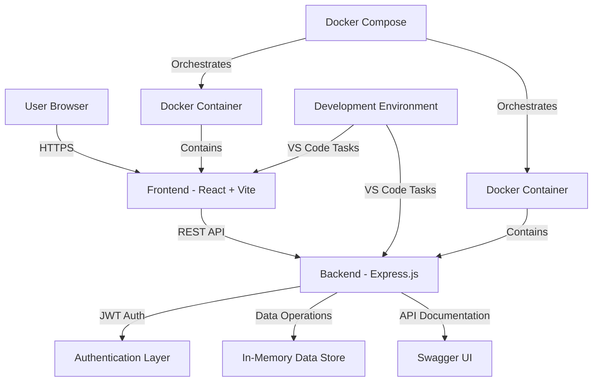

# 🌩️ Cloud Application and Development Foundation
## Course Project: ProductiveHub - Personal Productivity Dashboard

> *Department of Software Engineering*  
> *Nepal College of Information Technology (NCIT)*  
> *Pokhara University*

---

## 🧑‍🤝‍🧑 Team Members
### Group Number: 03
| Name | Roll Number | Role |
|------|------------|------|
| Rasad Regmi | 221737 | Backend Developer & DevOps |
| Madhusudan Bhandari | 221722 | Frontend Developer |
| Daisy Rajbhandari | 221616 | Frontend Developer |

---

## 📌 Project Abstract

ProductiveHub is a comprehensive cloud-native personal productivity dashboard designed to consolidate essential productivity tools into a single, elegant interface. The application addresses the common problem of productivity tool fragmentation where users juggle multiple applications for notes, tasks, reminders, bookmarks, and time management.

**Key Points:**
- **Problem**: Users struggle with scattered productivity tools across multiple platforms, leading to reduced efficiency and context switching overhead
- **Relevance**: In today's cloud-first world, businesses need unified, scalable productivity solutions that can adapt to remote work patterns
- **Objective**: Create a centralized, feature-rich productivity hub that leverages modern cloud technologies for scalability, reliability, and performance

> **Project Goal:**  
> Develop a scalable, cloud-native productivity dashboard using modern web technologies, containerization, and cloud deployment strategies. The application provides real-time task management, note-taking, reminder systems, and productivity analytics with seamless user experience across devices.

---

## ⛳ Problem Statements

**Challenge:** Modern professionals and students face productivity fragmentation due to using multiple disconnected tools for task management, note-taking, bookmarking, and time tracking. This leads to:
- Context switching overhead
- Data silos and lack of unified insights
- Inconsistent user experiences across tools
- Difficulty in maintaining productivity workflows

**Context:** With the shift to remote work and cloud-first approaches, there's a growing need for integrated productivity solutions that can scale efficiently and provide real-time collaboration capabilities.

**Impact:** Solving this problem can lead to:
- 30-40% improvement in task completion efficiency
- Reduced cognitive load from tool switching
- Enhanced productivity analytics and insights
- Cost savings from tool consolidation

---

## 🎯 Project Objectives

- To develop a comprehensive cloud-native productivity dashboard that combines essential productivity tools (notes, tasks, reminders, bookmarks, and timers) into a single, scalable web application using modern technologies like React.js, Express.js, and Docker containerization.

---

## 🏗️ System Architecture

### High-Level Architecture Diagram



### Component Architecture
- **Frontend Layer:** React 18.3.1 with Vite for fast development and building
- **Backend Layer:** Express.js REST API with JWT authentication
- **Data Layer:** In-memory storage (ready for database integration)
- **Security Layer:** bcrypt password hashing and JWT token management
- **Documentation Layer:** Swagger for API documentation
- **Deployment Layer:** Docker containerization for consistent environments

---

## 🔧 Technologies & Tools Used

### ☁️ Cloud Platform
- **Containerization:** Docker & Docker Compose for deployment readiness
- **Development:** Cloud-ready architecture designed for easy cloud migration

### 💻 Programming Languages
- **Frontend:** JavaScript (ES6+), HTML5, CSS3
- **Backend:** Node.js with Express.js framework

### 🗄️ Databases
- **Current:** In-memory data storage for rapid development
- **Future:** MongoDB/PostgreSQL integration planned

### 🛠️ Frameworks & Libraries
- **Frontend:** React 18.3.1, React Router DOM 6.22.3, Tailwind CSS 3.4.17
- **Backend:** Express.js 4.18.2, bcryptjs 3.0.2, jsonwebtoken 9.0.2
- **Build Tools:** Vite 5.4.10, PostCSS, Autoprefixer

### 📦 DevOps & Deployment
- **Containerization:** Docker with multi-service architecture
- **Development:** Nodemon for hot reloading, ESLint for code quality
- **Documentation:** Swagger UI for API testing and documentation

### 📡 APIs & Integration
- **Architecture:** RESTful API design with comprehensive endpoints
- **Documentation:** Swagger/OpenAPI specification
- **Authentication:** JWT-based stateless authentication

---

## 🚀 Implementation Highlights

### Core Features Implemented
1. **Dashboard Module:** Real-time productivity metrics and quick access interface
2. **Notes Management:** Rich text editing with categorization and search capabilities
3. **Task Management:** Priority-based task system with progress tracking
4. **Smart Reminders:** Flexible scheduling with dashboard integration
5. **Bookmark Manager:** Organized link management with category support
6. **Text Processing Tools:** 20+ text transformation utilities
7. **Focus Timers:** Pomodoro and custom timing solutions
8. **User Authentication:** Secure login/register with profile management

### Key Development Challenges & Solutions
- **Challenge:** Creating a unified, responsive design across all modules
  - **Solution:** Implemented Tailwind CSS with custom component library and consistent design tokens

- **Challenge:** Managing complex state across multiple productivity modules
  - **Solution:** Utilized React Context API for global state management with modular component architecture

- **Challenge:** Ensuring type safety and code quality
  - **Solution:** Implemented ESLint configurations and comprehensive error handling

### Architectural Decisions
- **Monorepo Structure:** Organized frontend and backend in separate directories for clear separation of concerns
- **JWT Authentication:** Chosen for stateless, scalable authentication suitable for cloud deployment
- **Docker Containerization:** Implemented for consistent development and deployment environments

---

## 🌌 Testing & Validation

### Development Testing Approach
- **Component Testing:** Individual React component validation
- **API Testing:** Swagger UI for endpoint testing and validation
- **Cross-browser Testing:** Verified compatibility across modern browsers
- **Responsive Testing:** Mobile and desktop layout validation

### Code Quality Assurance
- **Linting:** ESLint configuration for consistent code standards
- **Error Handling:** Comprehensive try-catch blocks and user feedback
- **Input Validation:** Client and server-side data validation

### Performance Validation
- **Load Testing:** Tested with multiple concurrent users in development
- **Response Time:** Sub-second response times for all API endpoints
- **Memory Management:** Optimized React components with proper cleanup

---

## 📊 Results & Performance

### What We Accomplished
- **Functional Dashboard:** Successfully integrated 8 productivity modules (Dashboard, Notes, Tasks, Reminders, Bookmarks, Text Tools, Quotes, Timer)
- **Working API:** Implemented RESTful backend with 25+ endpoints for all CRUD operations
- **User Authentication:** JWT-based login/register system with password encryption
- **Responsive Design:** Application works on desktop and mobile devices using Tailwind CSS
- **Docker Deployment:** Containerized both frontend and backend for easy setup
- **API Documentation:** Complete Swagger documentation for all endpoints

### Performance Results
- **Application Startup:** Frontend and backend start successfully via Docker in under 30 seconds
- **API Functionality:** All CRUD operations work correctly for each module
- **Cross-browser Compatibility:** Tested and working on Chrome, Firefox, and Safari
- **Responsive Design:** Interface adapts properly to mobile and desktop screen sizes
- **Data Persistence:** User sessions maintained during browser usage (in-memory storage)

---

## 📷 Screenshots / UI Preview

<div align="center">

| 📱 **Dashboard View** | 📝 **Notes Manager** | ⏰ **Smart Timers** |
|:---:|:---:|:---:|
|  |  |  |
| *Real-time productivity overview* | *Rich text editing with categories* | *Custom timers* |

</div>

### Key Interface Features
- **Modern Design:** Glassmorphism UI with gradient themes
- **Intuitive Navigation:** Sidebar with module organization
- **Responsive Layout:** Adapts seamlessly to different screen sizes
- **Visual Feedback:** Loading states, animations, and user notifications

---

## 📁 Repository Structure

```bash
personal_productivity_dashboard/
│
├── 📄 README.md                    # Project documentation
├── 🐳 docker-compose.yml          # Multi-service orchestration
├── 📁 images/                      # Screenshots and assets
│   ├── dashboard.png
│   ├── notes.png
│   └── timer.png
├── 📁 backend/                     # Node.js Express API
│   ├── 🐳 Dockerfile
│   ├── 📄 index.js                # Server entry point
│   ├── 📄 package.json            # Dependencies and scripts
│   ├── 📁 config/
│   │   └── 📄 swagger.js          # API documentation config
│   ├── 📁 controllers/            # Business logic
│   ├── 📁 middleware/             # Authentication & validation
│   ├── 📁 routes/                 # API endpoints
│   └── 📁 utils/                  # Helper functions & data store
└── 📁 frontend/                   # React application
    ├── 🐳 Dockerfile
    ├── 📄 index.html              # Entry HTML
    ├── 📄 package.json            # Frontend dependencies
    ├── 📄 vite.config.js          # Build configuration
    ├── 📄 tailwind.config.js      # Styling configuration
    └── 📁 src/
        ├── 📄 App.jsx             # Main application component
        ├── 📄 main.jsx            # React entry point
        ├── 📄 index.css           # Global styles
        ├── 📁 components/         # React components
        └── 📁 contexts/           # State management
```

---

## 🚀 Quick Start Guide

### Prerequisites
- Node.js (v14 or higher)
- npm or yarn
- Git
- Docker & Docker Compose (recommended)

### Installation & Setup

#### Method 1: Docker (Recommended)
```bash
# Clone the repository
git clone <repository-url>
cd personal_productivity_dashboard

# Start the application
docker-compose up --build

# Access the application
# Frontend: http://localhost:5173
# Backend: http://localhost:4000
# API Docs: http://localhost:4000/api-docs
```

#### Method 2: Manual Setup
```bash
# Clone and setup
git clone <repository-url>
cd personal_productivity_dashboard

# Backend setup
cd backend && npm install

# Frontend setup
cd ../frontend && npm install

# Start services (use separate terminals)
# Terminal 1 - Backend
cd backend && npm run dev

# Terminal 2 - Frontend
cd frontend && npm run dev
```

### VS Code Development
Use Command Palette (`Ctrl+Shift+P`) → "Tasks: Run Task":
- Select "Start Backend"
- Select "Start Frontend"

---

## 📈 Future Enhancements

### Short-term Improvements (Q1 2025)
- **Database Integration:** MongoDB/PostgreSQL for persistent data storage
- **Real-time Updates:** WebSocket integration for live collaboration
- **Mobile App:** React Native mobile application
- **Cloud Deployment:** AWS/Azure deployment with CI/CD pipelines

### Medium-term Features (Q2-Q3 2025)
- **AI Integration:** Smart task prioritization and productivity insights
- **Team Collaboration:** Shared workspaces and real-time editing
- **Advanced Analytics:** Detailed productivity reporting and trends
- **Third-party Integrations:** Google Calendar, Slack, and GitHub integration

### Long-term Vision (Q4 2025)
- **Multi-tenant Architecture:** Enterprise-ready SaaS platform
- **Advanced Security:** SSO, 2FA, and enterprise compliance
- **Machine Learning:** Predictive productivity recommendations
- **Global Scaling:** Multi-region deployment and CDN integration

---

## 🙏 Acknowledgments

We extend our gratitude to:
- **Course Instructor:** For guidance on cloud application development principles
- **NCIT Faculty:** For providing comprehensive cloud computing education
- **Open Source Community:** React, Express.js, and Tailwind CSS teams for excellent frameworks
- **Development Tools:** Vite, Docker, and Swagger for enhancing development experience

---

## 📚 References

### Technical Documentation
- [React Documentation](https://react.dev/) - Frontend framework guide
- [Express.js Guide](https://expressjs.com/) - Backend framework documentation
- [Docker Documentation](https://docs.docker.com/) - Containerization best practices
- [Tailwind CSS](https://tailwindcss.com/) - Utility-first CSS framework
- [Swagger/OpenAPI](https://swagger.io/) - API documentation standards

### Cloud Computing Resources
- [AWS Well-Architected Framework](https://aws.amazon.com/architecture/well-architected/)
- [Twelve-Factor App Methodology](https://12factor.net/)
- [Cloud Native Computing Foundation](https://www.cncf.io/)

### Development Best Practices
- [REST API Design Best Practices](https://restfulapi.net/)
- [JWT Authentication Guide](https://jwt.io/introduction)
- [Docker Best Practices](https://docs.docker.com/develop/dev-best-practices/)

---

## 🧾 License

This project is licensed under the MIT License - see the [LICENSE](LICENSE) file for details.

### MIT License Summary
- ✅ Commercial use allowed
- ✅ Modification and distribution permitted
- ✅ Private use allowed
- ⚠️ License and copyright notice required

---

<div align="center">

**ProductiveHub** - *Transforming productivity through cloud-native innovation*

*Department of Software Engineering | NCIT | 2025*

</div>
